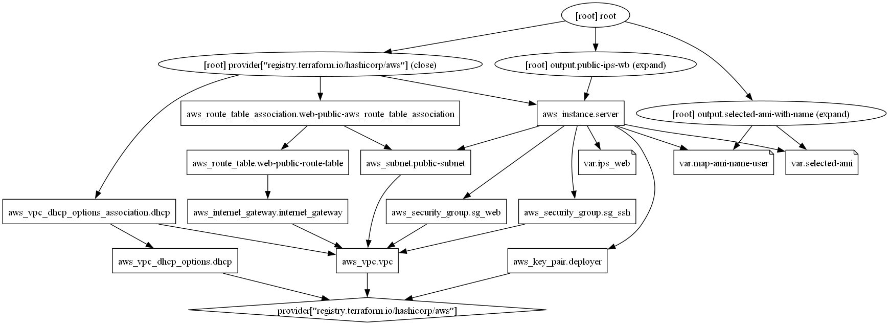

# Create AWS Infrastructure with Terraform VPC Public/Private Subnets Internet-gateway Security-groups EC2-Instances 

In this configuration, we will describe the possibility of creating more than one EC2 instance in a subnet.
[YouTube](https://www.youtube.com/watch?v=dlsGXc1Sewk&t=707s)
## Introdution To Terraform
The following resources will be used here:
- Amazon EC2 Instance
- VPC (Virtual Private Cloud)
- Public subnet and private subnet
- Internet Gateway
- Security Groups
- Key Pair

## Installation 
**Install aws cli (Command Line Interface)**
Install from the folowing Link:
https://docs.aws.amazon.com/cli/latest/userguide/getting-started-install.html
 - **AWS Configuration File (`~/.aws/config`):**
  - The region used for executing Terraform commands is typically taken from the AWS configuration file (`~/.aws/config`). The region specified in the Terraform provider block (`us-east-1`) is a fallback in case it's not specified in the AWS configuration file.

- **AWS Credentials File (`~/.aws/credentials`):**
  - AWS credentials (access key and secret key) used by Terraform are stored in the AWS credentials file (`~/.aws/credentials`).
  - These credentials can be configured using the `aws configure` command, which interactively prompts you to enter your AWS access key, secret key, default region, and output format.

- **Creating AWS User**
Log in to the `AWS Management Console`, navigate to `IAM`, and create a new user. Generate an access key for programmatic access; detailed steps are available in the accompanying video. Describing the `AWS Management Console` here is omitted as it is subject to continuous evolution and change

**Install Terraform**
Install from the folowing Link and follow the instruction
https://developer.hashicorp.com/terraform/install

Here is a Brief description of each Terraform command:

1. **`terraform init`**
   - **Purpose:** Initializes a Terraform configuration in the current directory.
   - **Usage:** Executed once per Terraform project to set up the working directory, download providers, and initialize the backend.

2. **`terraform validate`**
   - **Purpose:** Validates the Terraform files in the current directory for syntax and other errors.
   - **Usage:** Checks for configuration file syntax errors without creating any infrastructure.

3. **`terraform plan`**
   - **Purpose:** Creates an execution plan showing what actions Terraform will take to apply the current configuration.
   - **Usage:** Evaluates the current state of the infrastructure and compares it to the desired state, providing a preview of changes before they are applied.

4. **`terraform apply`**
   - **Purpose:** Applies the changes specified in the Terraform configuration, creating or modifying infrastructure.
   - **Usage:** Executes the planned changes as per the `terraform plan` output. It prompts for confirmation before applying changes.

5. **`terraform destroy`**
   - **Purpose:** Destroys all the resources created by the Terraform configuration in the current directory.
   - **Usage:** Safely removes infrastructure based on the defined Terraform configuration. It prompts for confirmation before initiating destruction.

These commands are fundamental to the Terraform workflow. `init` sets up the environment, `validate` checks for syntax errors, `plan` previews changes, `apply` executes changes, and `destroy` removes resources. It's essential to use them in the correct order and understand their implications on your infrastructure.

Finaly create a ssh key pair (ed25519) with pasphrase
```hcl
ssh-keygen -t ed25519 -C "your_email@example.com"
```


## [provider.tf](./provider.tf)

1. **Terraform Block:**

2. **Required Providers:**

3. **Terraform Version Constraint:**
   - The `required_version` specifies the minimum Terraform version required to apply this configuration. Here, it's set to at least version 1.6.0.

4. **Provider Block (AWS):**
   - The `provider` blocks define the configuration for specific providers. In this case, it's the AWS provider.
   - The `region = "us-east-1"` specifies the AWS region where the resources will be provisioned. EC2 instances, for example, will be launched in the "us-east-1" region.

## [main.tf](./main.tf)
This Terraform script orchestrates the creation of a VPC, EC2 instance, security groups, subnets, route tables, and DHCP options on AWS.
1. **Resource: `aws_key_pair`**
   - This defines an AWS SSH key pair named "deployer" with a specific public key.
2. **EC2 Instance Configuration `aws_instance`**
   - This resource block configures an EC2 instance with specific attributes such as AMI, instance type, key name, subnet, security groups, and more.
3. **Virtual Private Cloud (VPC) Configuration `aws_vpc`**
   - Defines a VPC with a specified CIDR block, DNS settings, and tags.
   - Configures security groups for SSH and webserver, allowing specified inbound and outbound traffic.
5. **Public Subnet `aws_subnet`**
   - Defines a public subnet within the VPC with a specific CIDR block and availability zone.
6. **Route Table `aws_route_table` and Internet Gateway `aws_internet_gateway`**
   - Creates a route table for the public subnet and associates it with an internet gateway for external connectivity.
7. **Route Table Association `aws_route_table_association`, DHCP Options `aws_vpc_dhcp_options` and association `aws_vpc_dhcp_options_association`** 
   - Associates the route table with the public subnet and configures DHCP options for the VPC.

## [variables.tf](./variables.tf)

The provided Terraform configuration defines several variables that are crucial for the setup of the infrastructure. Below is an explanation of each variable:

1. **IP Addresses for Web Servers (`ips_web`)**
   - **Type:** `map(string)` - Specifies that the variable is a map where the keys are strings and the values are strings.
   - **Default Values:** A mapping of indices ("0" to "4") to corresponding IP addresses for web servers.

2. **Selected Amazon Machine Image (AMI) (`selected-ami`)**
   - **Description:** Provides a description for the variable.
   - **Default Value:** Specifies the default Amazon Machine Image (AMI) to be used. In this case, it is set to "Ubuntu Server 22.04 LTS ubuntu".

3. **Mapping of AMI Names to AMI IDs (`map-ami-name-user`)**
   - **Type:** `map(string)` - Specifies that the variable is a map where the keys are strings, and the values are strings.
   - **Default Values:** Maps human-readable AMI names to their corresponding AMI IDs for various operating systems.

These variables provide flexibility and ease of configuration when deploying infrastructure using Terraform. Adjustments can be made based on specific requirements or changes in infrastructure needs.

## [output.tf](./output.tf)

The provided Terraform configuration defines two outputs, which are used to provide information or results after the infrastructure deployment. Below is an explanation of each output:

1. **Public IPs of Web Servers (`public-ips-wb`)**
   - **Description:** This output provides the public IP addresses of the web servers.
   - **Value:** Uses the `aws_instance.server.*.public_ip` expression to get a list of public IP addresses for all instances. The `join` function is then used to concatenate them into a comma-separated string.
   - **Usage:** After running Terraform apply, you can retrieve the public IPs of the deployed instances by accessing the `public-ips-wb` output.

2. **Selected AMI with Name Information (`selected-ami-with-name`)**
   - **Description:** This output provides information about the selected AMI, including its name and ID.
   - **Value:** Uses the `format` function to create a formatted string that includes the AMI name specified in `var.selected-ami` and its corresponding AMI ID obtained from `var.map-ami-name-user`.
   - **Usage:** After running Terraform apply, you can retrieve information about the selected AMI by accessing the `selected-ami-with-name` output.

These outputs are helpful for obtaining critical information or summaries after deploying infrastructure using Terraform. They provide a way to programmatically retrieve specific details about the deployed resources.

## Control the created instance
In the output, there will be a list `public-ips-wb` of started EC2 Instances (depending on `aws_instance.server.count`) visible. On these IPs, it is possible to log in over SSH to the created EC2 server.

The output `selected-ami-with-name` indicates the installed AMI with the Description and username.

```hcl
public-ips-wb = [
  "52.90.45.63",
]
selected-ami-with-name = "ami-by-name: Ubuntu Server 22.04 LTS ubuntu; ami-id: ami-0c7217cdde317cfec"
```

To SSH into the server:

```hcl
ssh -i timbuktu ubuntu@52.90.45.63 -v
```
In the browser, under http://52.90.45.63, something similar is visible:

```hcl
Private Ip: ip-10-0-1-101
Creation Time: Thu Jan 18 19:37:47 UTC 2024
```

The folowing code generating a relationship between the used resources, using [Graphviz](https://graphviz.org/).

```hcl
terraform graph -type=plan | dot -Tpng >graph.png
```
  
